# Qualitative Comparison: Reward Hacking in RL Fine-Tuning

FlowGRPO RL fine-tuning of **FLUX.2-klein-base-4B** on ImgEdit-Bench, comparing two reward models:
**EditReward** (a trained reward model) vs **RewardClaw** (ours).

On the held-out ImgEdit-Bench, RewardClaw improves **6/9** edit categories (Overall 3.32->3.52),
while EditReward improves **5/9** and degrades 4/9 (Overall 3.32->3.45). Below are qualitative cases where
the EditReward-trained editor exhibits reward-hacking / collapse (hallucinated content, global over-restyle,
or ignoring the instruction), while the RewardClaw-trained editor stays faithful and clean.

Each row: **Source | +EditReward (collapse) | +RewardClaw (ours)**.

| # | Edit type | Instruction | Failure of EditReward |
|---|---|---|---|
| 1 | remove | Remove the person in the image who is standing next to the fence by the railway track. | EditReward leaves person unchanged; RewardClaw removes cleanly with preserved scene |
| 2 | adjust | Change the animal's fur color to a light brown shade. | EditReward barely changes fur; RewardClaw cleanly makes bird light brown while preserving scene |
| 3 | adjust | Change the frosting color to a light blue. | EditReward barely changes frosting; RewardClaw cleanly makes it light blue. |
| 4 | style | Transfer the image into a faceted low-poly 3-D render style. | EditReward nearly unchanged; RewardClaw clean low-poly style faithful to scene |
| 5 | add | Add a small wooden cabin next to the fence on the left side of the ice rink. | EditReward barely adds/obscures cabin; RewardClaw adds clean cabin by left fence. |
| 6 | style | Transfer the image into a loose, flowing watercolor-wash style. | EditReward barely restyles/photo-like; RewardClaw clean watercolor wash faithful |
| 7 | compose | Remove the pink cushion on the ground, and change the drink in the woman's hand on the right to a green beverage. | EditReward crops/restyles and leaves drink non-green with cushion remnants; RewardClaw makes drink green and removes cushion cleanly |
| 8 | background | Change the traditional embroidered dress in the picture from a wedding setting to a casual garden setting. | EditReward hallucinates a person and heavily restyles; RewardClaw cleanly changes to garden while preserving subject. |
| 9 | background | Change the cathedral in the picture from a clear sky to a snowy environment. | EditReward hallucinates snowy mountain background/restyles scene; RewardClaw cleanly adds snow while preserving cathedral. |
| 10 | style | Transfer the image into a hand-sculpted claymation style. | EditReward adds figures/animals and barely applies claymation; RewardClaw cleanly clay-stylizes scene without major hallucination |
| 11 | extract | Extract the architectural structure visible in the background of the image, including all visible buildings and structural elements, while maintaining the surrounding environmental context such as the sky and nearby terrain. | EditReward hallucinates floating structure; RewardClaw cleanly preserves tent and environment |
| 12 | style | Transfer the image into an 8-bit pixel-art video-game style. | EditReward mostly leaves photo unchanged; RewardClaw cleanly applies 8-bit pixel-art style while preserving scene |
| 13 | add | Add a set of colorful beach towels hanging over the railing on the right side of the pier. | EditReward floats towels in water/air off pier; RewardClaw adds clean towels on right railing. |
| 14 | style | Transfer the image into a Lego-brick stop-motion diorama style. | EditReward adds Lego figures/clutter and inconsistent toys; RewardClaw cleanly converts castle/rocks into Lego diorama while preserving scene |
| 15 | replace | Replace the slices of cake in the image with slices of cookie. | EditReward mostly unchanged cake; RewardClaw replaces with cookie-like slices cleanly |
| 16 | add | Add a cat sitting on the table in the foreground. | ER adds odd table/ledge artifact and cat not on table; RC cleanly adds foreground cat with minimal scene change |
| 17 | extract | Extract the coffee mug visible in the image. | EditReward leaves full background instead of extracting mug; RewardClaw cleanly preserves mug though still includes beans/background |
| 18 | extract | Extract the chocolate bar sleigh with candy cane runners and teddy bear cookie rider from the image. | EditReward adds hallucinated rider/decorations instead of clean extraction; RewardClaw mostly preserves target cleanly. |
| 19 | style | Transfer the image into a faceted low-poly 3-D render style. | EditReward barely applies low-poly style; RewardClaw cleanly faceted subject/scene while preserving composition |
| 20 | compose | Remove the gift box in the air held by the woman on the right, and adjust the lighting to brighten the scene. | ER removes gift but has aspect/crop change, artifacts and degraded identities; RC cleanly removes gift and brightens scene |
| 21 | compose | Remove the basket of fruit on the coffee table, and change the color of the left armchair cushion to dark green. | EditReward over-restyles/crops and changes whole chairs; RewardClaw removes fruit and makes left cushion dark green cleanly |
| 22 | add | Add a person standing next to the open trunk of the car, looking inside, wearing casual clothes. | EditReward puts person sitting in trunk/not looking inside; RewardClaw adds standing person by trunk with minor artifacts |
| 23 | compose | Remove the smartphone from the man's hand, and adjust the woman's hair to appear more windblown. | EditReward removes phone but leaves heavy arm blur/artifacts; RewardClaw follows edit more cleanly. |
| 24 | style | Transfer the image into a hand-sculpted claymation style. | EditReward mostly color-shifts photo without claymation; RewardClaw applies clean clay-sculpted style while preserving scene. |

### 1. [remove] Remove the person in the image who is standing next to the fence by the railway track.
*EditReward:* EditReward leaves person unchanged; RewardClaw removes cleanly with preserved scene

### 2. [adjust] Change the animal's fur color to a light brown shade.
*EditReward:* EditReward barely changes fur; RewardClaw cleanly makes bird light brown while preserving scene

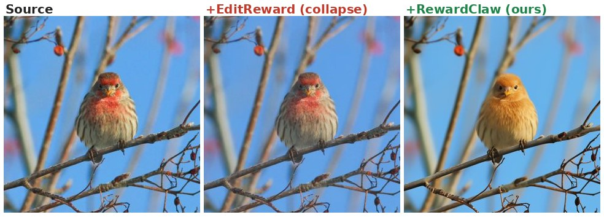

### 3. [adjust] Change the frosting color to a light blue.
*EditReward:* EditReward barely changes frosting; RewardClaw cleanly makes it light blue.

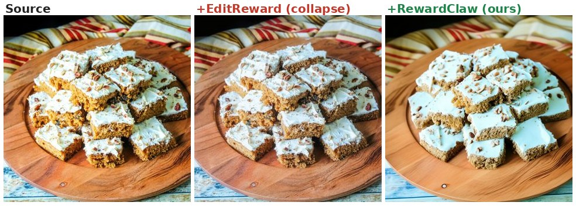

### 4. [style] Transfer the image into a faceted low-poly 3-D render style.
*EditReward:* EditReward nearly unchanged; RewardClaw clean low-poly style faithful to scene

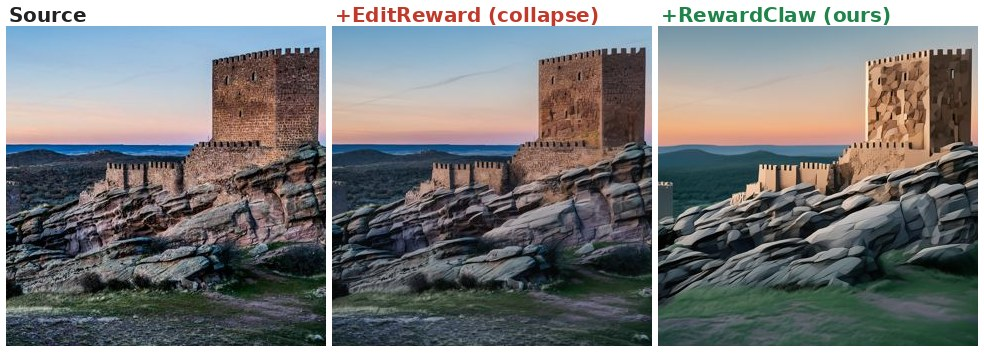

### 5. [add] Add a small wooden cabin next to the fence on the left side of the ice rink.
*EditReward:* EditReward barely adds/obscures cabin; RewardClaw adds clean cabin by left fence.

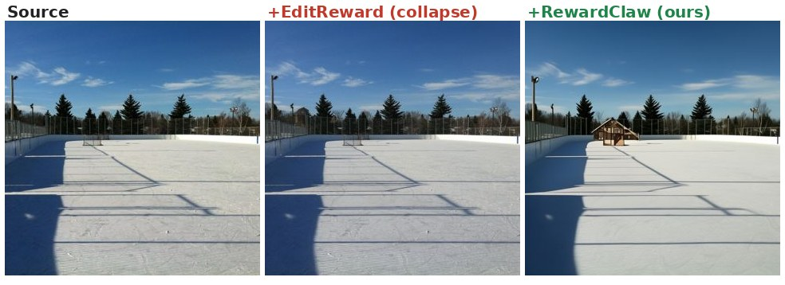

### 6. [style] Transfer the image into a loose, flowing watercolor-wash style.
*EditReward:* EditReward barely restyles/photo-like; RewardClaw clean watercolor wash faithful

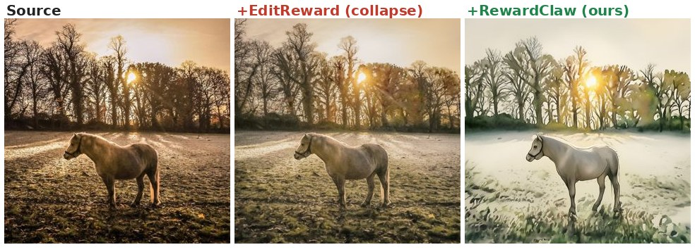

### 7. [compose] Remove the pink cushion on the ground, and change the drink in the woman's hand on the right to a green beverage.
*EditReward:* EditReward crops/restyles and leaves drink non-green with cushion remnants; RewardClaw makes drink green and removes cushion cleanly

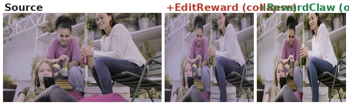

### 8. [background] Change the traditional embroidered dress in the picture from a wedding setting to a casual garden setting.
*EditReward:* EditReward hallucinates a person and heavily restyles; RewardClaw cleanly changes to garden while preserving subject.

### 9. [background] Change the cathedral in the picture from a clear sky to a snowy environment.
*EditReward:* EditReward hallucinates snowy mountain background/restyles scene; RewardClaw cleanly adds snow while preserving cathedral.

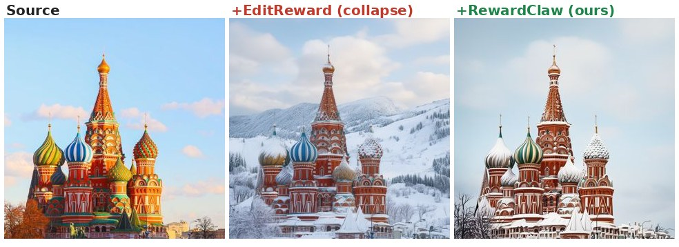

### 10. [style] Transfer the image into a hand-sculpted claymation style.
*EditReward:* EditReward adds figures/animals and barely applies claymation; RewardClaw cleanly clay-stylizes scene without major hallucination

### 11. [extract] Extract the architectural structure visible in the background of the image, including all visible buildings and structural elements, while maintaining the surrounding environmental context such as the sky and nearby terrain.
*EditReward:* EditReward hallucinates floating structure; RewardClaw cleanly preserves tent and environment

### 12. [style] Transfer the image into an 8-bit pixel-art video-game style.
*EditReward:* EditReward mostly leaves photo unchanged; RewardClaw cleanly applies 8-bit pixel-art style while preserving scene

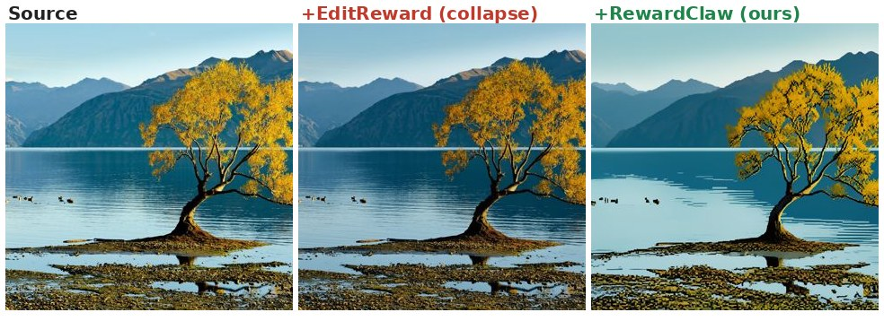

### 13. [add] Add a set of colorful beach towels hanging over the railing on the right side of the pier.
*EditReward:* EditReward floats towels in water/air off pier; RewardClaw adds clean towels on right railing.

### 14. [style] Transfer the image into a Lego-brick stop-motion diorama style.
*EditReward:* EditReward adds Lego figures/clutter and inconsistent toys; RewardClaw cleanly converts castle/rocks into Lego diorama while preserving scene

### 15. [replace] Replace the slices of cake in the image with slices of cookie.
*EditReward:* EditReward mostly unchanged cake; RewardClaw replaces with cookie-like slices cleanly

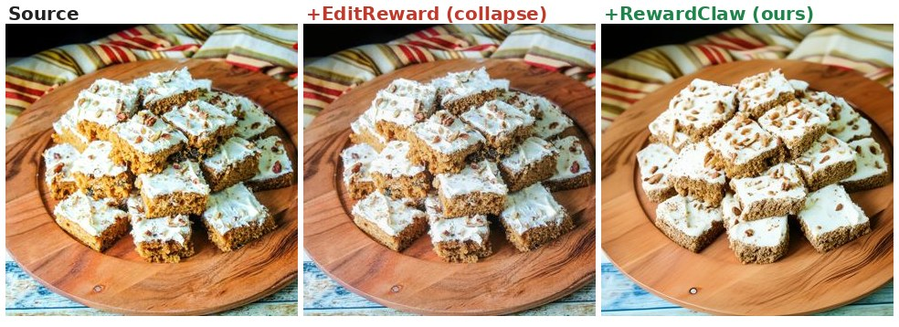

### 16. [add] Add a cat sitting on the table in the foreground.
*EditReward:* ER adds odd table/ledge artifact and cat not on table; RC cleanly adds foreground cat with minimal scene change

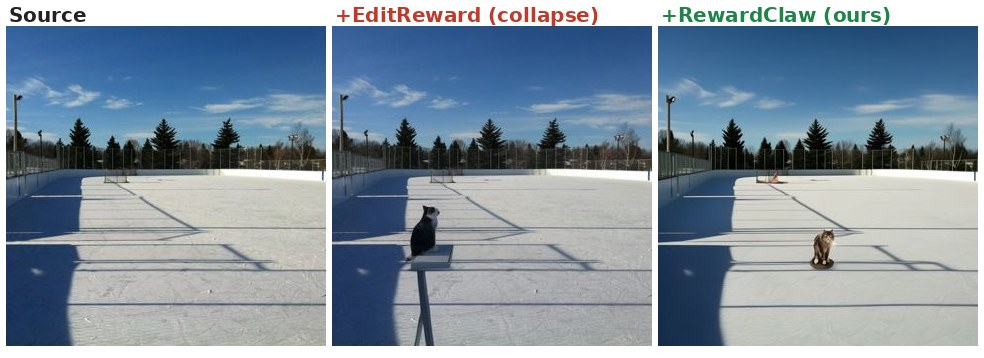

### 17. [extract] Extract the coffee mug visible in the image.
*EditReward:* EditReward leaves full background instead of extracting mug; RewardClaw cleanly preserves mug though still includes beans/background

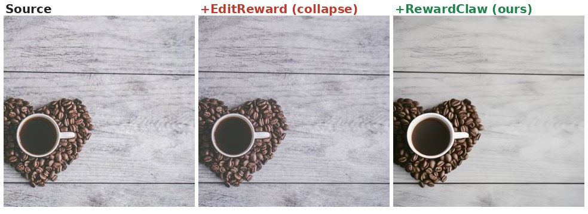

### 18. [extract] Extract the chocolate bar sleigh with candy cane runners and teddy bear cookie rider from the image.
*EditReward:* EditReward adds hallucinated rider/decorations instead of clean extraction; RewardClaw mostly preserves target cleanly.

### 19. [style] Transfer the image into a faceted low-poly 3-D render style.
*EditReward:* EditReward barely applies low-poly style; RewardClaw cleanly faceted subject/scene while preserving composition

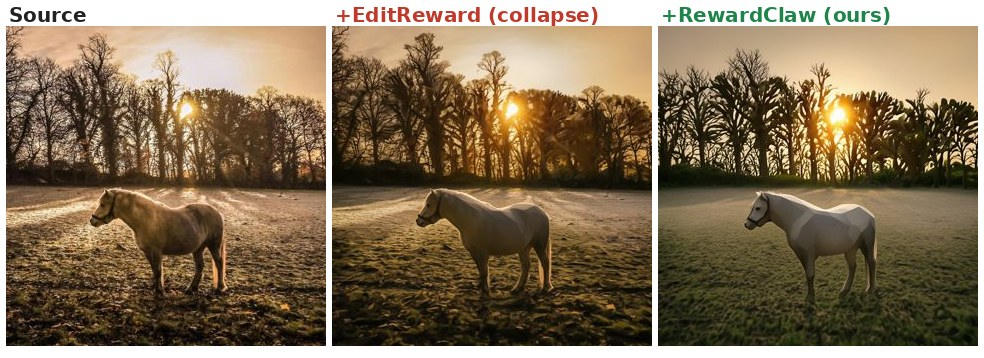

### 20. [compose] Remove the gift box in the air held by the woman on the right, and adjust the lighting to brighten the scene.
*EditReward:* ER removes gift but has aspect/crop change, artifacts and degraded identities; RC cleanly removes gift and brightens scene

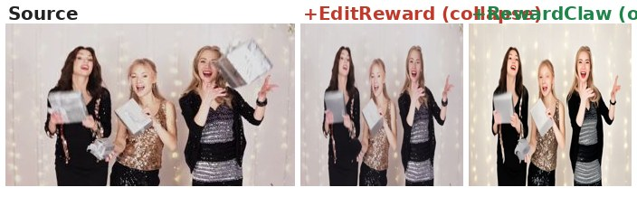

### 21. [compose] Remove the basket of fruit on the coffee table, and change the color of the left armchair cushion to dark green.
*EditReward:* EditReward over-restyles/crops and changes whole chairs; RewardClaw removes fruit and makes left cushion dark green cleanly

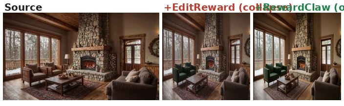

### 22. [add] Add a person standing next to the open trunk of the car, looking inside, wearing casual clothes.
*EditReward:* EditReward puts person sitting in trunk/not looking inside; RewardClaw adds standing person by trunk with minor artifacts

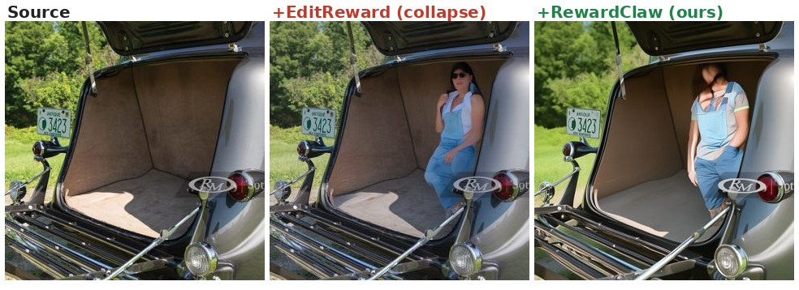

### 23. [compose] Remove the smartphone from the man's hand, and adjust the woman's hair to appear more windblown.
*EditReward:* EditReward removes phone but leaves heavy arm blur/artifacts; RewardClaw follows edit more cleanly.

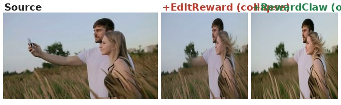

### 24. [style] Transfer the image into a hand-sculpted claymation style.
*EditReward:* EditReward mostly color-shifts photo without claymation; RewardClaw applies clean clay-sculpted style while preserving scene.

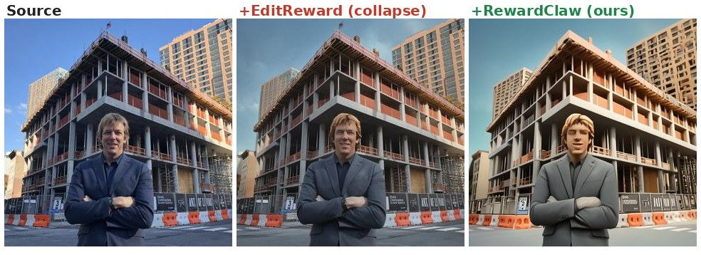
