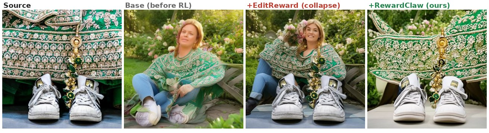
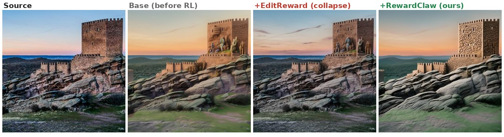
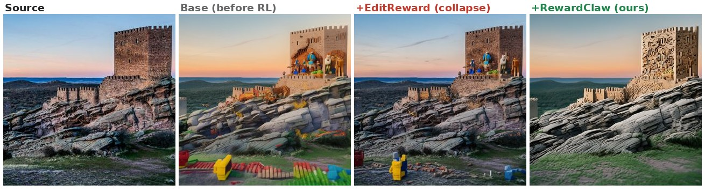
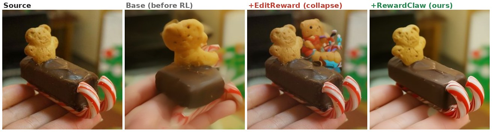
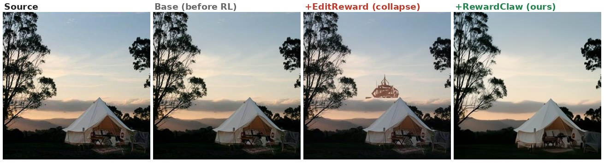
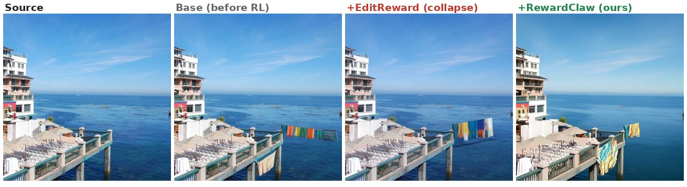
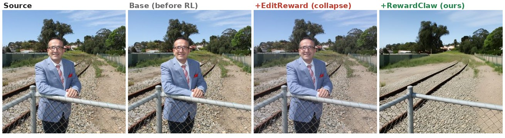

# Qualitative Comparison: Reward Hacking in RL Fine-Tuning

FlowGRPO RL fine-tuning of **FLUX.2-klein-base-4B** on ImgEdit-Bench, comparing two reward models: **EditReward** vs **RewardClaw** (ours).

On the held-out ImgEdit-Bench, **RewardClaw** improves **6/9** edit categories (Overall 3.32->3.52); **EditReward** improves 5/9 and degrades 4/9 (Overall 3.32->3.45). The **Base (before RL)** column shows the model is well-behaved before RL: the failures below are introduced by RL with the EditReward signal (reward hacking), while RewardClaw stays faithful.

Each row: **Source | Base (before RL) | +RL (EditReward) | +RL (RewardClaw, ours)**.

**1. [background]** Change the traditional embroidered dress in the picture from a wedding setting to a casual garden setting.

*EditReward hallucinates an entire extra person; Base & RewardClaw keep the subject.*

**2. [style]** Transfer the image into a hand-sculpted claymation style.

*EditReward inserts hallucinated figures and skips the clay style; RewardClaw cleanly claymates.*

**3. [style]** Transfer the image into a Lego-brick stop-motion diorama style.

*EditReward scatters random Lego clutter without converting the scene; RewardClaw rebuilds it in Lego.*

**4. [extract]** Extract the chocolate bar sleigh with candy cane runners and teddy bear cookie rider from the image.

*EditReward adds hallucinated decorations; RewardClaw extracts cleanly.*

**5. [extract]** Extract the architectural structure visible in the background of the image, including all visible buildings and structural elements, while maintaining the surrounding environmental context such as the sky and nearby terrain.

*EditReward hallucinates a floating wireframe artifact; RewardClaw stays clean.*

**6. [add]** Add a set of colorful beach towels hanging over the railing on the right side of the pier.

*EditReward floats the towels in the water; RewardClaw places them on the railing.*

**7. [remove]** Remove the person in the image who is standing next to the fence by the railway track.

*EditReward leaves the person in (edit ignored); RewardClaw removes it cleanly.*

