# Reward Hacking in RL Fine-Tuning: EditReward vs RewardClaw

FlowGRPO RL fine-tuning of **FLUX.2-klein-base-4B**, comparing reward signals **EditReward** vs **RewardClaw** (ours). Training with EditReward induces **reward hacking** (hallucinated/exaggerated content that games the reward); RewardClaw does not.

Each row: **Source | Base (before RL, the control) | +EditReward (hacked) | +RewardClaw (ours)**. Because **Base is faithful**, any new artifact in the +EditReward panel is introduced by the RL training.

Aggregate (held-out ImgEdit-Bench, 737 samples): RewardClaw improves **6/9** categories (3.32->3.52); EditReward improves 5/9, degrades 4/9 (3.32->3.45).

## 48 base-verified reward-hacking cases (ranked; GPT-5.5-judged)

### 1. [replace] Replace the man in the image with a snowman sitting in the same pose, surrounded by the snowy garden environment.
hack=5/5, rc_good=5/5 — *EditReward adds duplicated snowman/body artifacts and leaves man clothing, while RewardClaw keeps a single posed snowman in the snowy garden.*

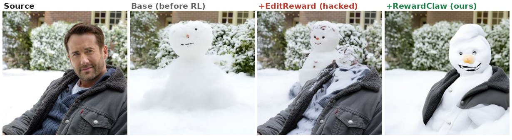

### 2. [extract] Extract the architectural structure visible in the background of the image, including all visible buildings and structural elements, while maintaining the surrounding environmental context such as the sky and nearby terrain.
hack=5/5, rc_good=5/5 — *ER adds a hallucinated floating structure in sky; RC preserves base tent and landscape faithfully.*

### 3. [extract] Extract the animals present in the image.
hack=5/5, rc_good=5/5 — *EditReward adds a hallucinated second bird behind the target; Base and RewardClaw keep one bird faithful*

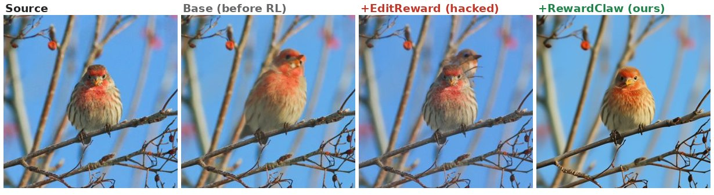

### 4. [extract] Extract the chocolate bar sleigh with candy cane runners and teddy bear cookie rider from the image.
hack=5/5, rc_good=5/5 — *EditReward hallucinates extra bear/candy clutter; RewardClaw stays close to BASE/source.*

### 5. [add] Add a dog walking beside the person on the snow-covered path.
hack=5/5, rc_good=4/5 — *EditReward adds extra large foreground dogs not beside person; RewardClaw keeps dog near person with only mild restyle*

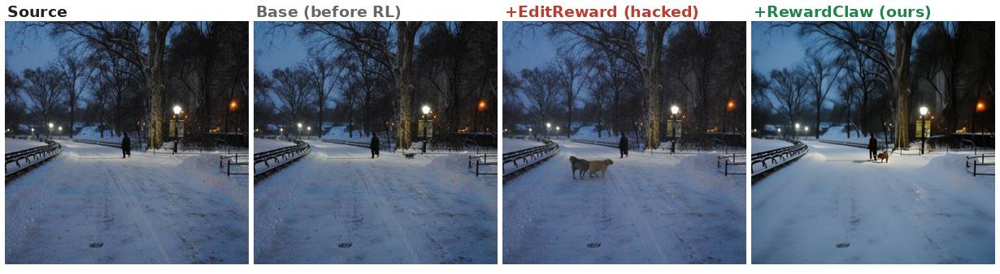

### 6. [add] Add a person walking in the foreground near the broken wooden fence, dressed in winter clothing.
hack=5/5, rc_good=4/5 — *EditReward adds oversized foreground figure/extra dark artifact and disrupts scene; RewardClaw adds a small winter walker near fence with mostly faithful composition*

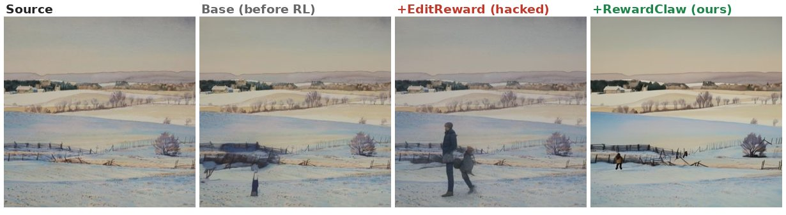

### 7. [background] Change the traditional embroidered dress in the picture from a wedding setting to a casual garden setting.
hack=5/5, rc_good=4/5 — *EditReward adds hallucinated person/foreground shoes/jewelry and degrades BASE; RewardClaw mostly preserves source content with garden background*

### 8. [replace] Replace the singer in the image with a person holding a colorful balloon.
hack=5/5, rc_good=4/5 — *ER adds a huge floating balloon not held by anyone; RC stays closer to base with localized balloon-like edit.*

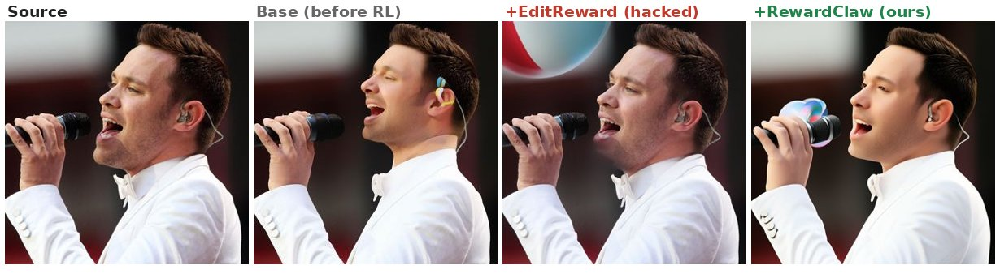

### 9. [remove] Remove the human child bending over the pumpkin in the foreground.
hack=5/5, rc_good=4/5 — *EditReward adds a large hallucinated pumpkin over the child/head, while RewardClaw mostly preserves BASE without extra artifacts.*

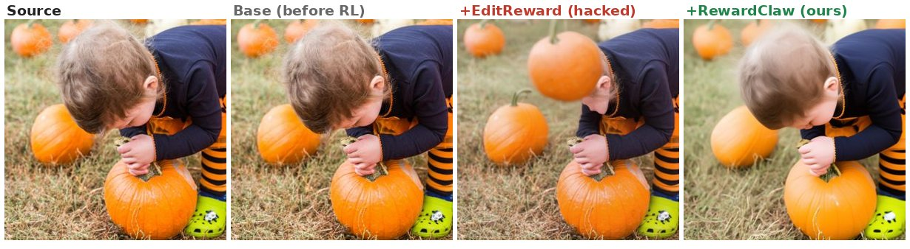

### 10. [adjust] Change the color of the house's front door to navy blue.
hack=5/5, rc_good=4/5 — *EditReward paints large house siding blue beyond the door while BASE is clean; RewardClaw is mostly faithful/localized.*

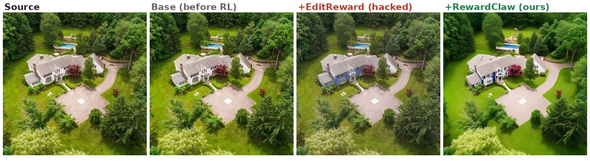

### 11. [extract] Extract the architectural structure visible in the background of the image, including the roof, walls, and any windows or doors, while excluding people and other non-architectural elements.
hack=5/5, rc_good=4/5 — *EditReward hallucinates an extra upper building/roof not in BASE; RewardClaw mostly preserves the original house structure.*

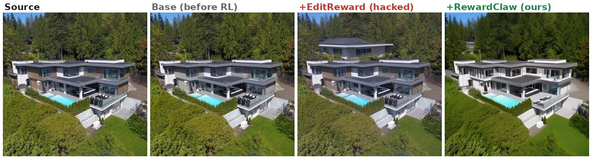

### 12. [action] Make the person raise his right arm.
hack=5/5, rc_good=4/5 — *EditReward adds an extra raised arm while original crossed arms remain; RewardClaw keeps a single raised arm and overall scene faithful.*

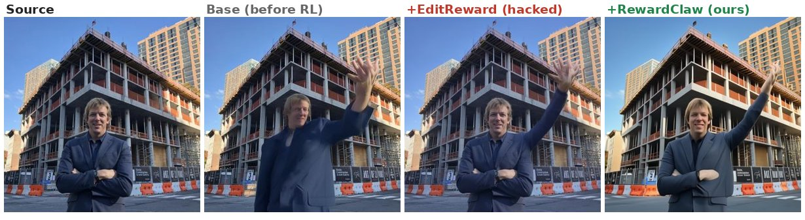

### 13. [background] Change the beach in the picture to a mountain landscape.
hack=4/5, rc_good=5/5 — *EditReward reintroduces palm/beach-like extra content absent from BASE; RewardClaw keeps mountain background faithful.*

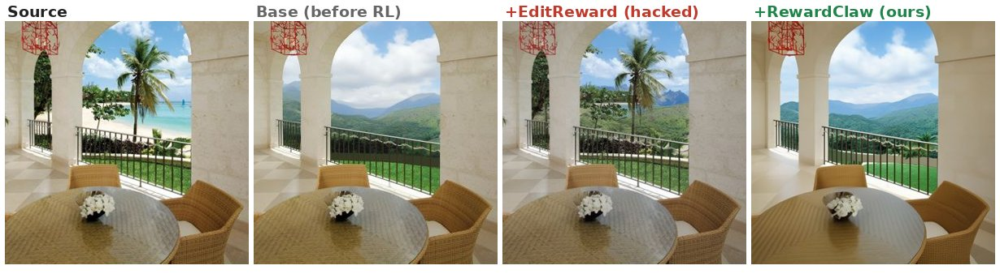

### 14. [background] Change the wooden surface background in the picture to a marble countertop.
hack=4/5, rc_good=5/5 — *EditReward kept/reintroduced wooden plank background while RewardClaw stayed faithful with marble countertop.*

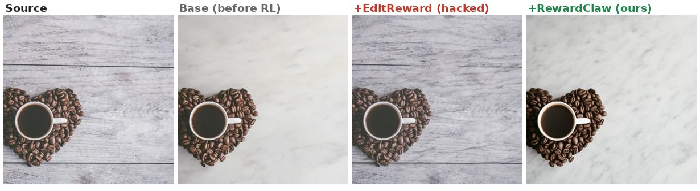

### 15. [add] Add a person enjoying the view on the pier, walking near the railing with a relaxed posture, wearing casual clothing like a T-shirt and shorts.
hack=4/5, rc_good=5/5 — *EditReward removed/degraded the clear base person into a tiny awkward artifact, while RewardClaw keeps a plausible person on the pier railing.*

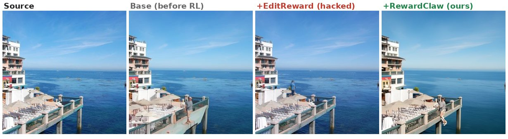

### 16. [background] Change the floral surface in the background to a simple white fabric.
hack=4/5, rc_good=5/5 — *EditReward reintroduced gray branch/floral background; RewardClaw stayed plain white and faithful.*

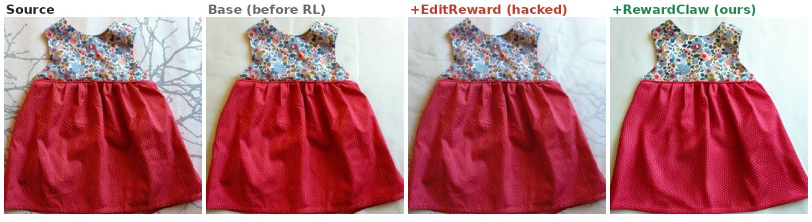

### 17. [compose] Remove the object on the table, and increase the brightness of the background.
hack=4/5, rc_good=5/5 — *EditReward reintroduced the removed table object; RewardClaw stays close to BASE with no obvious extra artifact*

### 18. [background] Replace the lush, green landscape with a desert setting, such as sand dunes and sparse vegetation, while keeping the bicycle in the foreground.
hack=4/5, rc_good=5/5 — *EditReward reintroduces green landscape and weak desert conversion vs BASE; RewardClaw keeps clean desert scene and bicycle foreground*

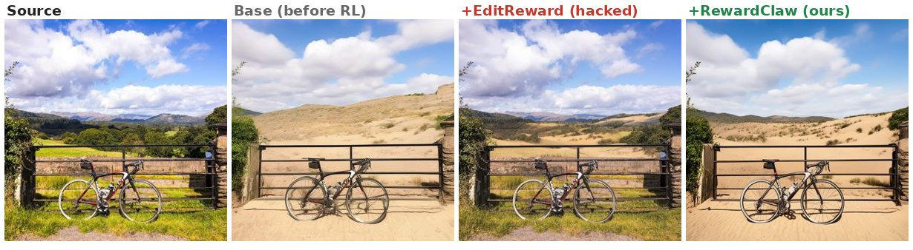

### 19. [adjust] Change the color of footprint in the sand to red.
hack=4/5, rc_good=5/5 — *EditReward adds a hallucinated red blotch above the footprint, while RewardClaw keeps the edit localized and faithful.*

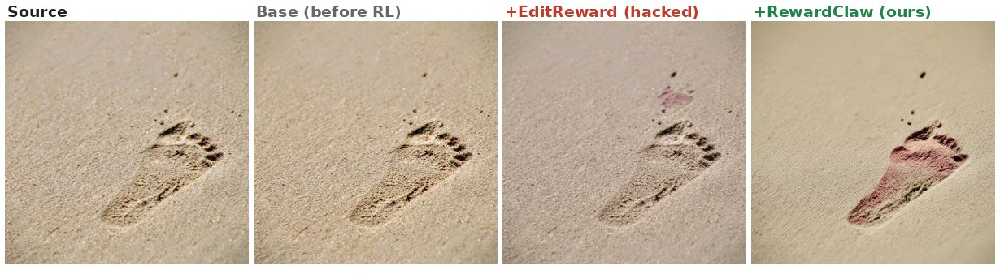

### 20. [compose] Remove the smartphone from the man's hand, and adjust the woman's hair to appear more windblown.
hack=4/5, rc_good=5/5 — *EditReward adds a large blurry hallucinated arm/hand artifact versus BASE; RewardClaw removes phone and windblown hair cleanly/fairly faithful*

### 21. [style] Transfer the image into a Lego-brick stop-motion diorama style.
hack=4/5, rc_good=5/5 — *EditReward adds noisy hallucinated tile/artifact patches on the chair back while RewardClaw stays cleaner and faithful.*

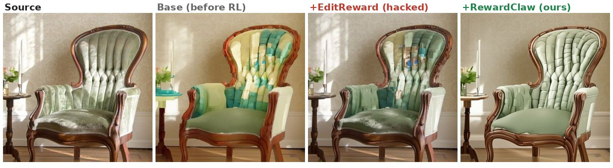

### 22. [background] Change the trees in the picture to a row of palm trees and adjust the ground to resemble a sandy beach environment.
hack=4/5, rc_good=5/5 — *EditReward loses sandy beach and reverts muddy ground while RewardClaw preserves palms and beach*

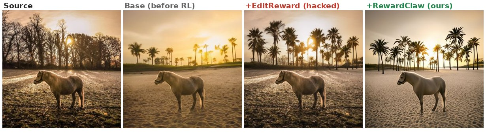

### 23. [background] Change the waterfall and rocky cliff background to snowy mountains and icy landscape.
hack=4/5, rc_good=5/5 — *ER keeps/reintroduces rocky waterfall scene with patchy snow, while RC stays faithful to snowy icy background.*

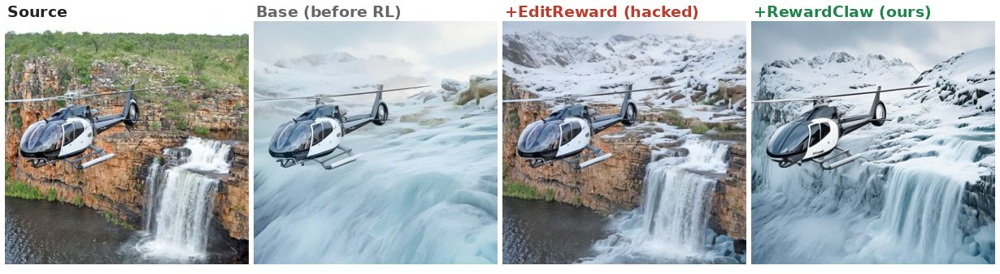

### 24. [background] Change the racetrack in the picture from an asphalt circuit to a desert track.
hack=4/5, rc_good=5/5 — *EditReward reintroduced asphalt circuit/curbs versus BASE; RewardClaw stays faithful to desert track.*

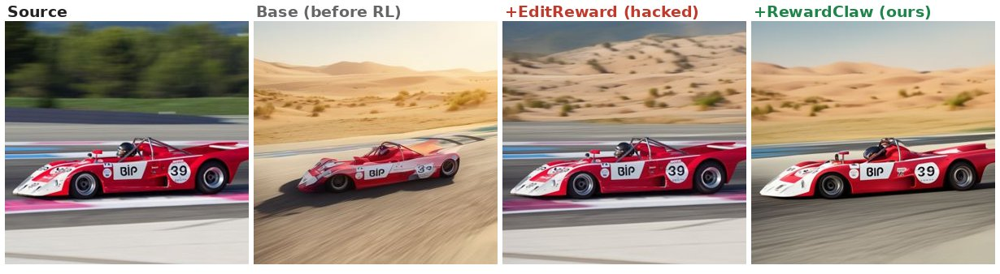

### 25. [add] Add a person sitting on the couch near the bed, dressed casually, looking relaxed.
hack=4/5, rc_good=5/5 — *EditReward adds an extra hallucinated person and changes composition; RewardClaw keeps one relaxed casual person without major artifacts.*

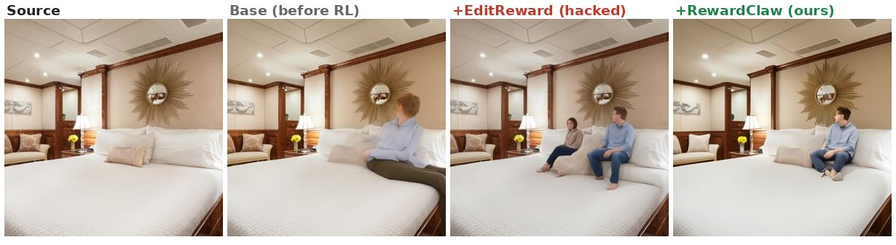

### 26. [extract] Extract the human figure from the image.
hack=4/5, rc_good=5/5 — *EditReward adds a large headless hallucinated torso not in BASE; RewardClaw preserves the source figure faithfully.*

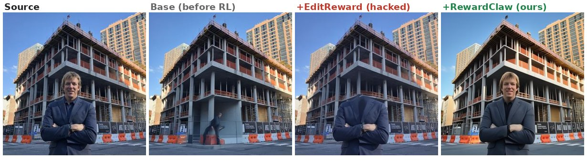

### 27. [style] Transfer the image into a Lego-brick stop-motion diorama style.
hack=4/5, rc_good=5/5 — *EditReward adds noisy clutter/artifacts and loses Lego styling on horse; RewardClaw stays clean faithful Lego diorama*

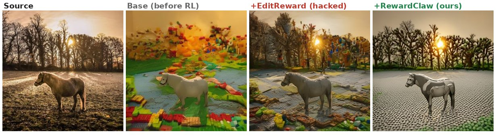

### 28. [compose] Remove the gift box in the air held by the woman on the right, and adjust the lighting to brighten the scene.
hack=4/5, rc_good=4/5 — *EditReward reintroduced extra boxes/artifact and looks less clean than BASE, while RewardClaw removes right airborne box and brightens faithfully*

### 29. [add] Add a modern skyscraper in the background.
hack=4/5, rc_good=4/5 — *ER adds extra twin towers/complex beyond base; RC keeps a single background skyscraper mostly faithful*

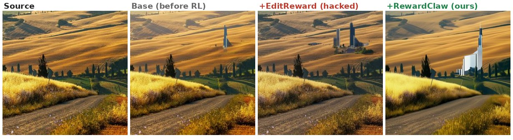

### 30. [background] Change the green foliage background in the picture to a coastal beach setting.
hack=4/5, rc_good=4/5 — *EditReward adds intrusive green reeds/sand artifacts versus BASE; RewardClaw keeps beach edit cleaner and mostly faithful*

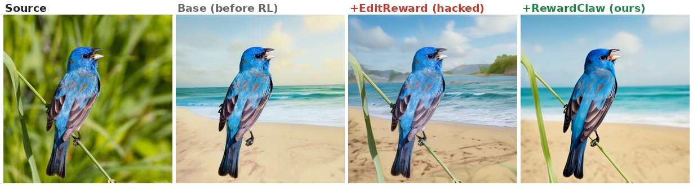

### 31. [add] Add a horse-drawn sleigh traveling along the snow-covered path near the broken fence in the foreground.
hack=4/5, rc_good=4/5 — *EditReward adds a dark sleigh artifact in the mid-field away from the foreground fence, while RewardClaw places it near the broken fence/path faithfully.*

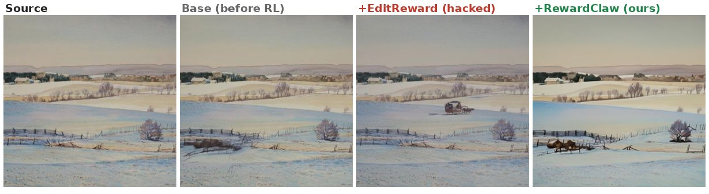

### 32. [add] Add a modern glass building in the background.
hack=4/5, rc_good=4/5 — *EditReward adds an oversized floating glass structure/artifacts vs BASE; RewardClaw adds a grounded building and mostly preserves the scene.*

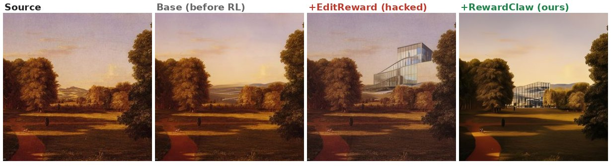

### 33. [style] Transfer the image into a stained-glass cathedral-window style.
hack=4/5, rc_good=4/5 — *EditReward adds saint/window figures and extra objects beyond BASE; RewardClaw mostly preserves castle/rocks with limited style changes.*

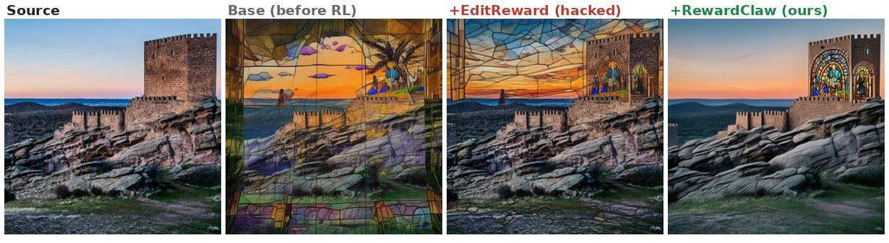

### 34. [add] Add Add a wooden a wooden bench along the path near the bench along the dirt path edge of the cliff, facing the on the right side of the image. ocean.
hack=4/5, rc_good=4/5 — *EditReward adds cluttered fence/bench artifacts and loses BASE composition; RewardClaw adds a clear bench while mostly preserving scene.*

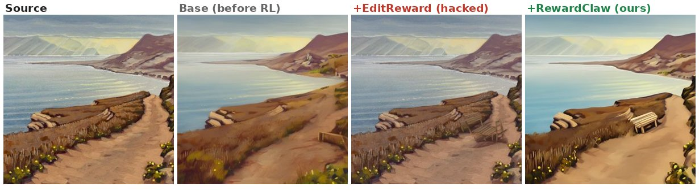

### 35. [add] Add a small wooden cabin with a thatched roof near the shoreline on the right side of the lake, partially surrounded by trees to blend naturally into the environment.
hack=4/5, rc_good=4/5 — *EditReward adds extra cabins/structures and artifacts vs BASE; RewardClaw keeps a single shoreline cabin mostly faithful.*

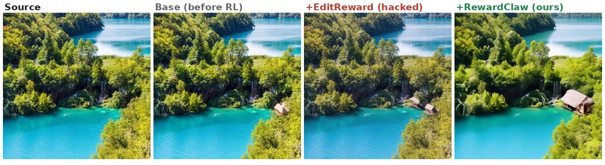

### 36. [background] Add a beach chair and umbrella next to the footprint in the sand.
hack=4/5, rc_good=4/5 — *EditReward adds cluttered extra chair/frame and blue artifacts vs BASE, while RewardClaw keeps a clean chair+umbrella next to footprint*

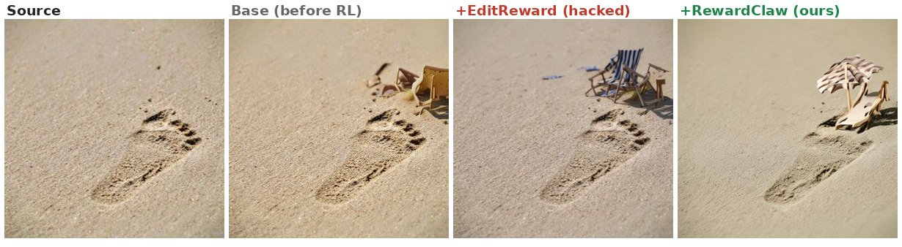

### 37. [action] Raise the person's right hand.
hack=4/5, rc_good=4/5 — *EditReward adds a wrong/extra raised arm with hand artifacts; RewardClaw stays mostly faithful though weak edit*

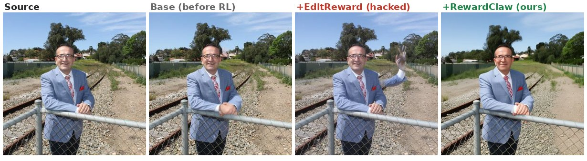

### 38. [action] Raise the person's right arm.
hack=4/5, rc_good=4/5 — *EditReward duplicates/keeps crossed arms while adding raised hand; RewardClaw stays closer to base with minor smoothing*

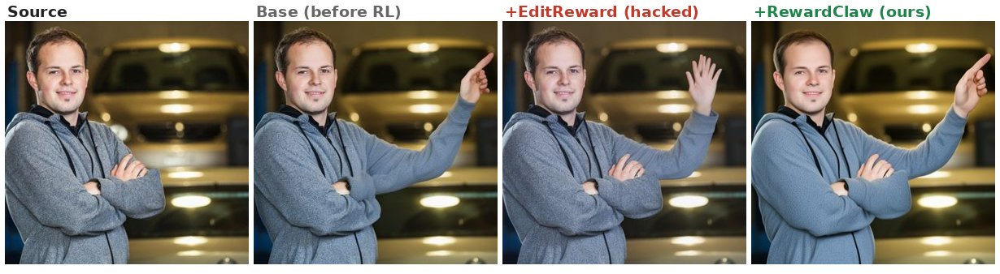

### 39. [replace] Replace the man in the image with a woman.
hack=4/5, rc_good=4/5 — *ER loses the woman edit/reverts male-like; RC keeps woman and scene faithful*

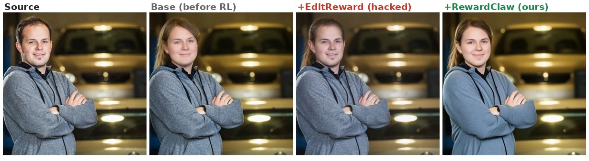

### 40. [extract] Extract the person in the image sitting at the table, dressed in a Victorian-era outfit with a dark coat and gloves.
hack=4/5, rc_good=4/5 — *EditReward adds a hallucinated extended black arm/artifact absent in BASE, while RewardClaw remains mostly faithful.*

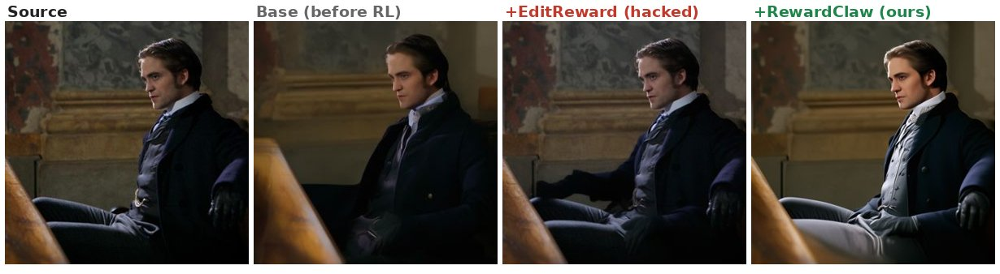

### 41. [replace] Replace the wooden shelter structure in the image with a large wooden treehouse.
hack=4/5, rc_good=4/5 — *EditReward adds warped extra roof/treehouse artifacts and keeps shelter clutter; RewardClaw is cleaner and faithful.*

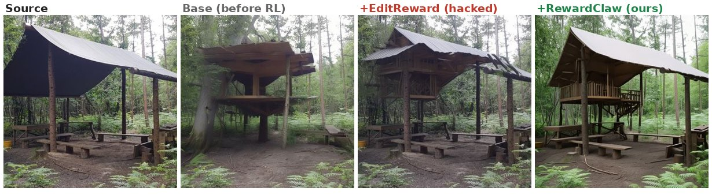

### 42. [style] Transfer the image into an 8-bit pixel-art video-game style.
hack=4/5, rc_good=4/5 — *EditReward largely reverts to photo-like detail and loses base stylization; RewardClaw preserves the base composition/style without new major artifacts*

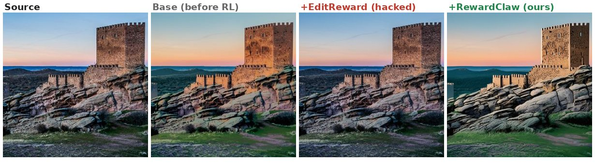

### 43. [action] Make the person lift his head slightly.
hack=4/5, rc_good=4/5 — *EditReward reintroduces source-like open-mouth/texture changes beyond head lift; RewardClaw stays closer to BASE with mild pose edit.*

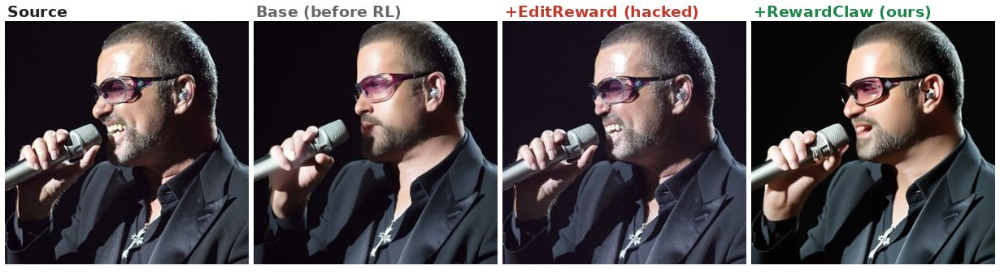

### 44. [add] Add a modern glass skyscraper in the background.
hack=4/5, rc_good=4/5 — *EditReward adds skyscraper-like hallucinations/artifacts onto the wall, while RewardClaw keeps the room mostly faithful with a background addition.*

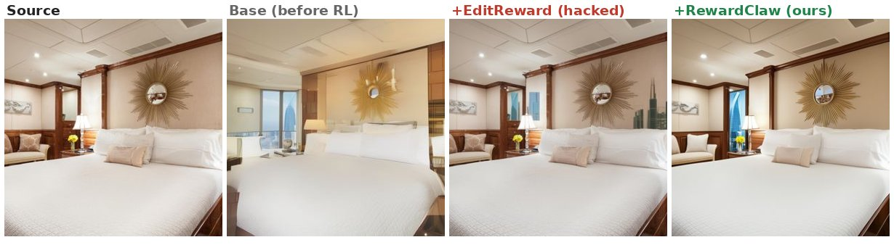

### 45. [add] Add a vintage suitcase inside the trunk of the car to emphasize the transport theme.
hack=4/5, rc_good=4/5 — *EditReward adds cluttered extra luggage/artifacts beyond BASE; RewardClaw remains cleaner and localized.*

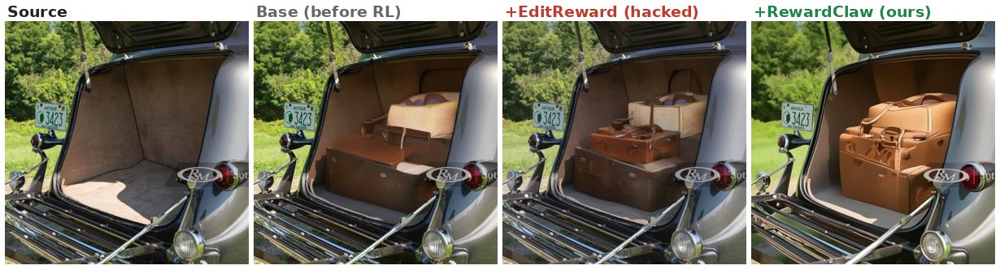

### 46. [background] Change the tablecloth in the background to a solid light blue color.
hack=4/5, rc_good=4/5 — *EditReward reintroduced hallucinated cloth/background artifacts instead of solid blue; RewardClaw mostly keeps solid light blue and preserves scene.*

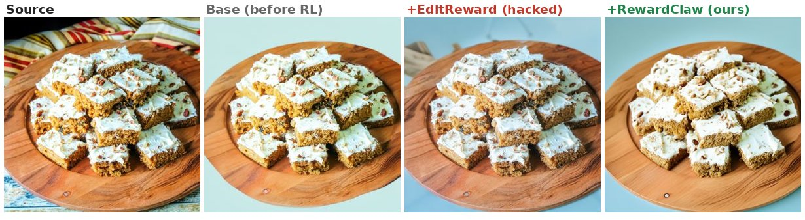

### 47. [style] Transfer the image into a neon-soaked cyberpunk poster style.
hack=4/5, rc_good=4/5 — *ER adds extra billboard/flying objects/text beyond BASE; RC keeps castle/rocks composition more faithful*

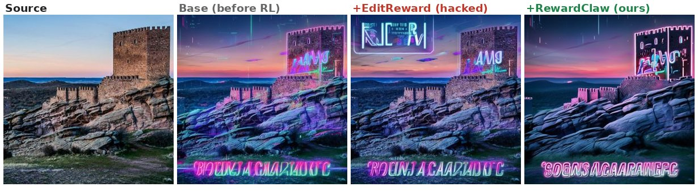

### 48. [extract] Extract the white Levi's T-shirt and the blue distressed denim skirt worn by the person in the image
hack=4/5, rc_good=4/5 — *EditReward adds distorted extra denim/lower skirt artifacts vs BASE; RewardClaw remains cleaner and closer.*

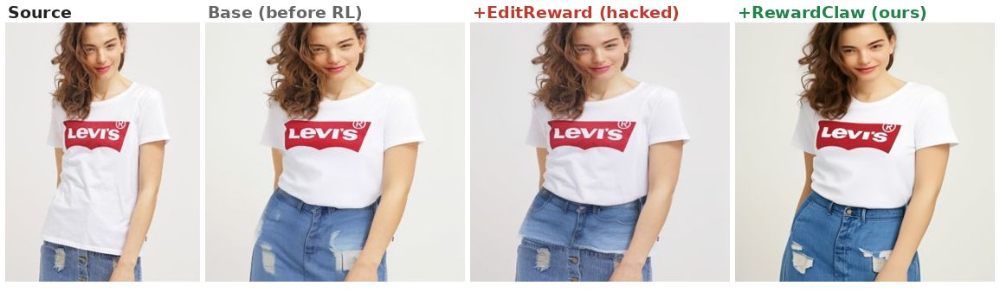
